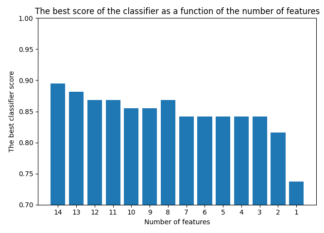

# Hearth Attack Prediction
**AI Supervised learning from data**  
***Created in June 2021***

---

## Description
- Program using machine learning classification algorithm has to decide, based on the data vector, whether a person could have hearth attack or not.
- As part of learning 4 different classification algorithms was used and compared:

1. **KNN**
2. **Decision Tree**
3. **Random Forest**
4. **SVN**

## Train and test data
- Data used to train and test describe values read from the sensors and decision of two values, yes - 1 or not - 0.
- train data shape (227, 15)
- test data shape (76, 115)
---

## All data Results 
Algorithm       | max accuracy I reached    |
 -------------- | ------------------------- |
KNN             |           82.9%           |
Decision Tree   |           89.5%           |
Random Forest   |           88.2%           |
SVN             |           86.8%           |

Considering all input vector data equally useful is the best classifier is Random Forest. 

---
Using previously trained Random Forest it is easy to conclude what parts of input data are most useful.  
Diagram of Random Forest features importances:

Using *gamma* parameter in *process_data_using_importances()* it is easy to declare how many features are to be trained for classifiers. <be />
Chart shows what is the best score of classifiers in function of the number features.

## 12 out of 14 features Results
Algorithm       | max accuracy I reached    |
 -------------- | ------------------------- |
KNN             |           82.9%           |
Decision Tree   |           84.2%           |
Random Forest   |           84.2%           |
SVN             |           86.8%           |
---

## Technology used
+ Python 3.9.5
+ scikit-learn
+ pandas
+ matplotlib
+ numpy

---

## License & copyright
© All rights reserved
